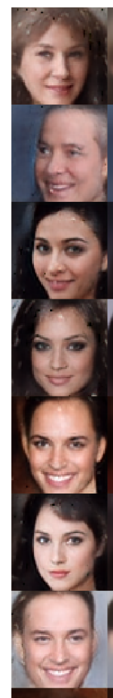

# BEGAN: Boundary Equilibrium Generative Adversarial Network

Basic Tensorflow implementation of [BEGAN](https://arxiv.org/abs/1703.10717) in <= 250 lines of code. 

## Dependencies

1. Tensorflow r0.12 (will update to newest one next week)
2. Tensorbayes
3. Numpy
4. Pillow

## Train
### Data Preparation

Download `img_align_celeba.zip` for the [CelebA dataset](https://drive.google.com/drive/u/0/folders/0B7EVK8r0v71pWEZsZE9oNnFzTm8) and unzip to a directory. Then save the 64 x 64 CelebA crops in `.mat` format.

```bash
python prepare_celeba_zoom.py --source-dir /path/to/img_align_celeba --dest-file /path/to/celeba_64_zoom.mat
```

### Train
To train the BEGAN model, execute

```bash
python main.py --data /path/to/celeba_64_zoom.mat
```

### Results
Preliminary results after 140k iterations for config (gamma=0.5, embedding size=64) provided:


